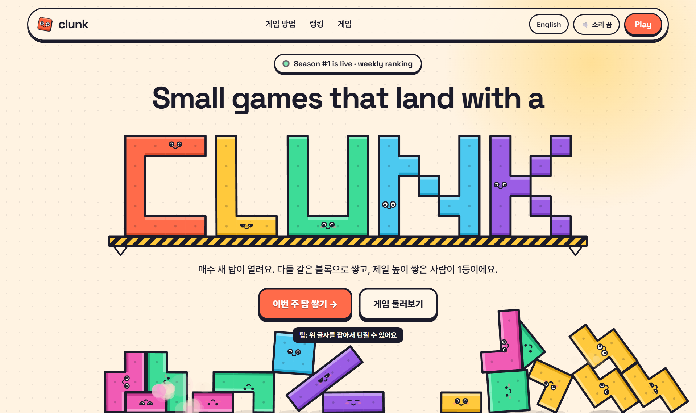

박준성의 제품 포트폴리오 · 신입 PM / PO / 서비스 기획

# 사람들이 하려던 일을, 끝낼 수 있는 제품으로.

### 안녕하세요, 박준성입니다.

장보기 추천을 받아도 구매 준비는 여전히 번거롭고, 
여행 사진을 많이 찍어도 어떤 순간을 남길지 고르기는 어렵습니다. 
짧은 게임도 친구와 같은 조건에서 겨루고 결과를 보여줄 수 있어야 다시 하게 됩니다.

저는 이런 **목표와 실행 사이의 번거로움**을 제품 과제로 삼았습니다. 
시장 조사·콘텐츠 기획 경험을 바탕으로 문제·사용자 흐름·완료 기준을 정하고, 
AI 도구가 구현을 보조하는 방식으로 시제품을 만들고 결과를 검수합니다.

[이력서](docs/resume.ko.md) · [제품 사례](docs/cases/README.md) · [English](README.en.md)

 

---

## 세 가지 문제, 세 개의 제품

| 제품 | 누구의 어떤 일을 쉽게 만들고 싶은가 | 현재 확인할 수 있는 범위 |
| --- | --- | --- |
| **[딱담아](docs/cases/ddakdama.md)** | 장볼 품목은 정했지만 상품을 다시 검색·비교해야 하는 사람의 구매 준비 | GPTs·Chrome 확장 프로그램 흐름, 데모, 공개 코드 · 고객 성과 미측정 |
| **[여사친 · 구 픽토리](docs/cases/pictory.md)** | 여행 후 비슷한 사진 중 남길 컷을 고르기 어려운 사람의 선택 | 앱인토스 개편 화면과 핵심 흐름 · 출시 전 검증 중 |
| **[Clunk](https://clunk.games/ko)** | 짧게 한 판 하는 사람이 친구와 같은 조건에서 겨루고 결과를 공유하는 일 | 무료 주간 랭킹 게임 2종 운영 중 · 정제된 외부 사용자 수·재방문 미검증 |

## 01 · 딱담아
### 장보기 추천이 실제 구매 준비로 이어지도록

**만든 이유**  
AI가 장볼 목록을 추천해 줘도 사용자는 쇼핑몰에서 상품을 다시 검색하고, 용량과 가격을 비교하고, 장바구니를 채워야 합니다. 목록과 쇼핑몰 사이에서 반복되는 일을 줄이고 싶었습니다.

구현 UI를 담은 데모 이미지 · 상품·가격은 재현용 샘플 데이터

**제품으로 풀어낸 방식**  
목록 입력 → 상품 후보 검토 → 담기 전 확인 → 장바구니 전달로 이어지는 흐름을 만들었습니다. GPTs에서는 목록을 구조화하고 Chrome 확장 프로그램에서는 쿠팡 후보와 장바구니를 확인하며, 웹에서도 별도로 시작할 수 있습니다.

**핵심 판단**  
사용자가 원하는 것은 빠르게 담기는 장바구니이면서, 동시에 **내가 사려던 상품이 정확히 담긴 장바구니**입니다. 그래서 “50mL 두 개”와 “두 개 묶음 한 개”를 구분하고, 애매한 후보는 사용자가 검토하도록 했습니다. 일부 상품에 문제가 생겨도 가능한 항목과 다시 확인할 항목을 알려주도록 설계했습니다.

**내가 맡은 일** · 문제·사용자 흐름 정의, 상품·수량 판단 기준, 실패 후 복구 동선, AI 도구가 구현을 보조하도록 작업을 정리하고 결과를 검수
**현재 결과** · 목록부터 결과 확인까지 연결된 제품 흐름과 데모가 있습니다. 데모의 상품·가격은 샘플 데이터이며, 최신 빌드의 실제 구매 준비 시간·완료율·고객 성과는 측정하지 않았습니다.

[제품 사례 읽기 →](docs/cases/ddakdama.md) · [51초 데모 →](https://youtu.be/hpRkAGgw03c) · [저장소 →](https://github.com/Artemis-ignis/ddakdama)

---

## 02 · 여사친 (구 픽토리 · 앱인토스)
### 여행 사진을 골라주는 친구

**만든 이유**  
여행에서 돌아오면 비슷하게 찍은 사진이 많이 남습니다. 어떤 컷을 남길지 하나씩 비교하다가 앨범 만들기를 미루게 되는 부담을 줄이고 싶었습니다. 범용 사진 정리 앱이던 픽토리를 **앱인토스에서 여행 후 ‘남길 사진을 고르는 일’에 집중하는 여사친**으로 개편하고 있습니다.

2026.09.10 개편 구현 화면 · 실제 홈 화면, 친구 일러스트는 AI 생성 브랜드 이미지 · 정식 출시 전

**제품으로 풀어낸 방식**  
여행 사진 선택 → 추천 후보·유사 컷을 보며 같이 고르기 → 이름 있는 여행 앨범에 보관하는 흐름입니다. 사진을 분류하는 데서 끝내지 않고, 사용자가 좋아하는 순간을 골라 앨범으로 남기는 데 초점을 맞췄습니다.

**핵심 판단**  
밝기·선명도는 후보를 제안하는 참고 신호이지, 좋은 추억을 대신 결정하는 기준은 아닙니다. **추천은 제품이, 마지막 선택은 사용자가** 하도록 구성했습니다. 기본 정리는 무료이며 광고·AI 크레딧으로 흐름을 막지 않습니다. 기본 분류는 기기 안에서 처리하고, 사용자가 AI 경로를 명시적으로 선택한 경우에만 일반 사진 일부를 384px JPEG로 줄여 Gemini 추천에 보냅니다. 원본 삭제나 클라우드 백업을 약속하지 않습니다.

**내가 맡은 일** · 여행 사진 선택으로 제품 방향 구체화, 사용자 흐름·무료 범위·신뢰 기준 설정, AI 도구가 구현을 보조하도록 작업을 정리하고 결과를 검수
**현재 결과** · 개편 UI와 사진 선택·추천·비교·여행 앨범 흐름이 구현된 출시 준비 단계입니다. 실제 토스 앱의 사진 권한·파일 저장과 사용자 선택 부담 감소, 고객 성과는 별도 검증 과제입니다.

[개편 이유와 제품 사례 →](docs/cases/pictory.md) · [기획 브리프 →](docs/cases/pictory-brief.md) · [저장소 →](https://github.com/Artemis-ignis/pictory-apps-in-toss)

---

## 03 · Clunk
### 매주 같은 블록으로 탑을 쌓는 무료 웹 게임

**만든 이유**  
짧은 캐주얼 게임은 많지만, 친구와 같은 조건에서 겨루고 결과를 보여줄 이유는 적습니다. 매주 모두가 같은 블록으로 같은 탑을 쌓고, 결과를 이미지 한 장으로 공유하는 '주간 도전' 경험을 만들었습니다.

**방향을 바꾼 이유**  
Clunk는 게임 에셋을 찾고·검사하고·프로젝트에 적용하는 도구로 시작했습니다. 하지만 측정된 매출이 없었고, 무료 에셋 팩과 경쟁하는 구독으로는 목표 매출에 필요한 유료 사용자 수가 너무 많았으며, 홈 한 화면에서 마켓·검사기·AI 제작·MCP가 경쟁해 방문자가 무엇을 써야 할지 고르기 어려웠습니다. 그래서 2026년 9월, 기존 에셋 기능은 남겨 두되 **clunk.games를 바로 플레이할 수 있는 게임 사이트**로 전환했습니다.

2026.09.24 운영 사이트 홈 캡처 · 게임 카드 일부 아트는 AI 생성 이미지

**제품으로 풀어낸 방식**  
매주 월요일 새 탑 → 모두에게 같은 블록이 같은 순서로 → 탭해서 쌓기(하트 3개) → 주간 랭킹 → 높이·순위가 찍힌 결과 이미지로 X·카카오톡 공유. 두 번째 게임 Clunk Puzzle(줄 채우기)도 주간 랭킹으로 운영하고, 한국어·영어를 지원합니다.

**핵심 판단**  
랭킹이 의미 있으려면 조건이 공정해야 합니다. 시즌마다 같은 블록 순서를 주고, 비정상적으로 높은 기록은 바로 반영하지 않고 검토 대기로 둡니다. Puzzle은 클라이언트가 보낸 점수를 믿지 않고 서버가 조작 기록을 다시 재생해 점수를 계산합니다. 첫 외부 게시 뒤 한 IP가 여러 계정으로 랭킹전을 반복한 것을 발견해 IP당 가입 수를 제한했습니다. 게임물 등급분류 전까지는 유료 상품과 광고 없이 무료·비상업으로 운영합니다.

**내가 맡은 일** · 에셋 도구에서 게임 사이트로의 방향 전환 결정, 게임 규칙·주간 랭킹·공정성 정책, 공유 흐름과 무료 운영 범위 설정, AI 도구가 만든 게임·사이트 결과 검수  
**현재 결과** · Season #1 운영 중. 커뮤니티 게시 직후 집계는 신규 플레이어 61명·서로 다른 IP 49개·랭킹전 208판입니다. 다계정 플레이가 섞여 있어 정제된 외부 사용자 수·재방문율은 아직 성과로 주장하지 않습니다. 매출은 없습니다.

[이번 주 탑 쌓기 →](https://clunk.games/ko) · [Clunk Puzzle →](https://clunk.games/puzzle) · [이전 버전(에셋 도구) 사례 →](docs/cases/clunk.md)

Clunk 소스 저장소는 비공개로 유지하고, 공유 가능한 화면과 제품 경험만 소개합니다.

---

## 제품을 어떻게 기획하는지 더 보고 싶다면

제품 화면을 바탕으로 사용자 과업을 요구사항과 검증 계획으로 구체화했습니다. 아래는 이번 포트폴리오를 위해 재구성한 문서입니다.

- [딱담아 · 구매 준비 시간과 정확도를 함께 확인하기](docs/cases/ddakdama-brief.md)
- [여사친 · 여행 사진 선택에 집중하도록 제품 범위 바꾸기](docs/cases/pictory-brief.md)
- [Clunk(이전 버전) · 다운로드에서 실제 사용 준비까지 확인하기](docs/cases/clunk-brief.md)

## 팀에 가져갈 수 있는 경험

**조사한 내용을 실행으로 연결합니다.**  
메타체인에서 NFT·DAO·P2E 시장을 조사하고, 내부 교육 자료와 투자 제안서·콘텐츠·사이트·Discord 작업에 참여했습니다. 복잡한 정보를 상대가 이해하고 다음 행동을 결정할 수 있는 자료로 정리하는 경험을 쌓았습니다.

**기획을 화면과 작동하는 흐름으로 구체화합니다.**  
개인 제품에서는 요구사항과 우선순위를 정하고 AI 도구가 구현을 보조하도록 작업을 나눴습니다. 화면과 파일 결과를 보면서 의도와 다른 부분을 찾고, 수정 내용을 다시 확인했습니다.

**만드는 사람의 제약을 이해하려고 합니다.**  
LPK Robotics 설계 인턴으로 2D 도면·3D 모델링·간섭 검토를 경험했습니다. 제품을 설명할 때 원하는 모습뿐 아니라 실제 구현 조건도 함께 확인하는 태도로 이어졌습니다.

| 경험·학습 | 기간 |
| --- | --- |
| 메타체인 · 게임 콘텐츠 기획·마케팅 | 2022.06–2023.05 |
| LPK Robotics · 설계 인턴 | 2024.08–2024.09 |
| 동양미래대학교 · 경영정보학과 전문학사 | 2017.03–2023.02 |
| 패스트캠퍼스 · AI Product Manager 심화 캠프 10기 | 수강 중 |

**PM 도구·검증** · 제품 문서(요구사항·수용 기준·체크리스트) · 사용자 여정/JTBD · Figma · Notion · 제품 QA · Playwright·GitHub Actions 기반 검증 흐름 이해

**AI 활용과 검증 경계** · 문제·사용자·우선순위·완료 기준과 품질 판단은 제가 맡고, AI 도구는 코드·문서·시각 자료 제작을 보조했습니다. 실행 결과는 브라우저·파일·테스트로 확인하며, 고객 수·매출·전환율·시간 절감처럼 확인하지 못한 수치는 성과로 주장하지 않습니다.

### 다음에는 팀과 함께 검증하고 싶습니다.

직접 제품을 만들며 쌓은 실행력을 고객 인터뷰, 팀 협업, 출시 후 지표 분석으로 넓히고 싶습니다. AI 서비스와 커머스·콘텐츠 제품의 **신입 PM/PO·서비스 기획** 기회를 찾고 있습니다.

[이력서 읽기 →](docs/resume.ko.md) · [English resume →](docs/resume.en.md)

개인 제품에서 맡은 역할은 기획·AI 도구를 통한 구현 조율·검수입니다.
