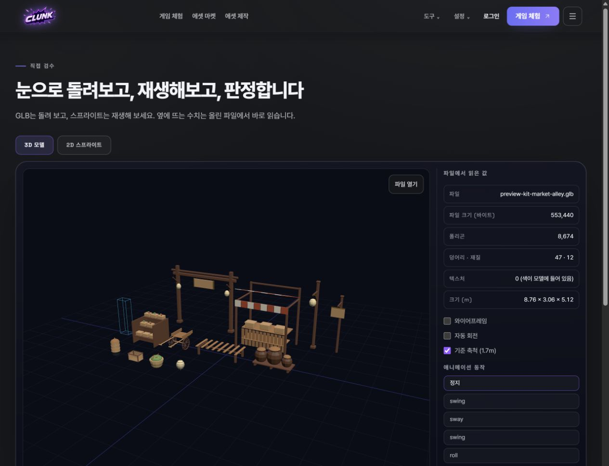

# Clunk · 게임 에셋 확보·제작·검사·적용을 연결하는 제품 브리프

[제품 사례](clunk.md) · [포트폴리오 홈](../../README.md)

> 작성일: 2026.09.12. 기존 구현·최신 라이브 화면·작업 기록을 바탕으로 포트폴리오용으로 재구성한 제품 브리프입니다. 당시 원본 PRD나 이미 실행한 고객 조사 결과를 뜻하지 않습니다.

## 해결하려는 과업

게임 제작자가 아이디어에 맞는 에셋을 구하고, 자신의 제작 환경에서 사용할 수 있게 준비하는 일입니다. 탐색·제작·파일 확인이 여러 도구로 나뉘면서 생기는 부담을 줄이려 합니다.

**해결 가설:** 에셋 확보·제작과 미리보기, 실제 파일 확인, 프로젝트 적용을 연결하면 결과물을 사용하기까지의 준비 과정을 더 쉽게 이해하고 진행할 수 있습니다.

2026.09.12 공개 검수 뷰어에서 새로 촬영한 화면입니다. 파일에서 읽은 값과 미리보기를 보여주며, 최적화 완료나 상업적 품질 승인을 뜻하지 않습니다.

## 목적을 구체적인 요구사항으로 옮기기

| 사용자 질문 | 제품에서 제공할 것 | 확인 기준 |
| --- | --- | --- |
| 내가 만들 게임에 어울리나? | 에셋 탐색·미리보기·상세 정보 | 외형과 사용 조건을 확인한 뒤 선택할 수 있음 |
| 실제 파일은 어떤 상태인가? | 파일 검사 정보와 결과 | 설명·미리보기와 실제 파일 사실을 대조할 수 있음 |
| 변환 후 원본과 무엇이 달라졌나? | 별도 결과와 재검사 기록 | 입력·출력과 검사 기록을 연결할 수 있음 |
| 내 환경에서 사용할 수 있나? | 다운로드와 사용 준비 정보 | 목표 환경에서 직접 열어 보는 과업으로 확인해야 함 |

## 범위를 정하는 기준

에셋을 많이 나열하는 것만으로 제작 준비가 끝나지는 않습니다. 한 에셋을 선택해 확인하고 받아 쓰는 과업이 이어지는지 먼저 확인해야 합니다.

자동 파일 검사로 알 수 있는 구조적 사실과 화면 품질은 다른 판단입니다. 이 경계를 보여주면 사용자가 무엇을 더 확인해야 하는지 알 수 있습니다. 따라서 전 엔진 호환이나 모든 파일의 적합성을 포괄적으로 약속하는 것은 현재 범위에 포함하지 않습니다.

## 제품 변경을 설명할 수 있는 근거

2026.09.12 공개 화면과 프로젝트 작업 기록에는 키트 카탈로그, 3D 검수 뷰어, 광산 플레이 시제품과 3D 미리보기 조작 검수가 남아 있습니다. 사용자가 에셋을 살펴보고 다음 단계로 이동할 수 있는지 화면에서 확인하며 수정한 사례입니다. 이 화면은 무료 베타의 현재 구현을 보여주며 고객 납품이나 상업적 품질을 증명하지 않습니다.

공개로 읽을 수 있는 파일 검사 구현은 [clunk-mcp](https://github.com/Artemis-ignis/clunk-mcp)에 있습니다. 위 제품 작업 기록과 비공개 소스 전체를 공개 저장소의 검증 범위로 합산하지 않습니다.

## 다음 사용자 검증 설계

**과업:** 제작자가 만들고 있는 장면과 목표 엔진을 정한 뒤, 필요한 에셋을 찾고 다운로드해 해당 환경에서 열어 봅니다.

| 확인 질문 | 기록할 것 | 다음 결정 |
| --- | --- | --- |
| 적절한 에셋을 찾았나? | 탐색부터 선택까지 경로·포기 이유 | 원하는 유형이 없으면 공급 범위, 찾기 어렵다면 탐색 구조 개선 |
| 파일 정보를 이해했나? | 규격·검사 결과를 보고 내린 선택과 질문 | 이해되지 않는 용어·검사 안내를 개선 |
| 제작 준비가 끝났나? | 실제 가져오기와 표시 성공, 사용자가 판단한 적합 여부 | 다운로드 성공과 엔진 적용 실패를 구분해 원인 해결 |
| 다시 사용할 가치가 있나? | 다음 과업에서의 자발적 재사용과 이유 | 반복 사용을 막는 비용·품질·공급 문제 우선순위 결정 |

완료율과 반복 사용 수치는 아직 측정하지 않았습니다. 기술 성공과 사용자가 느끼는 결과물의 적합성을 함께 기록할 예정입니다.
