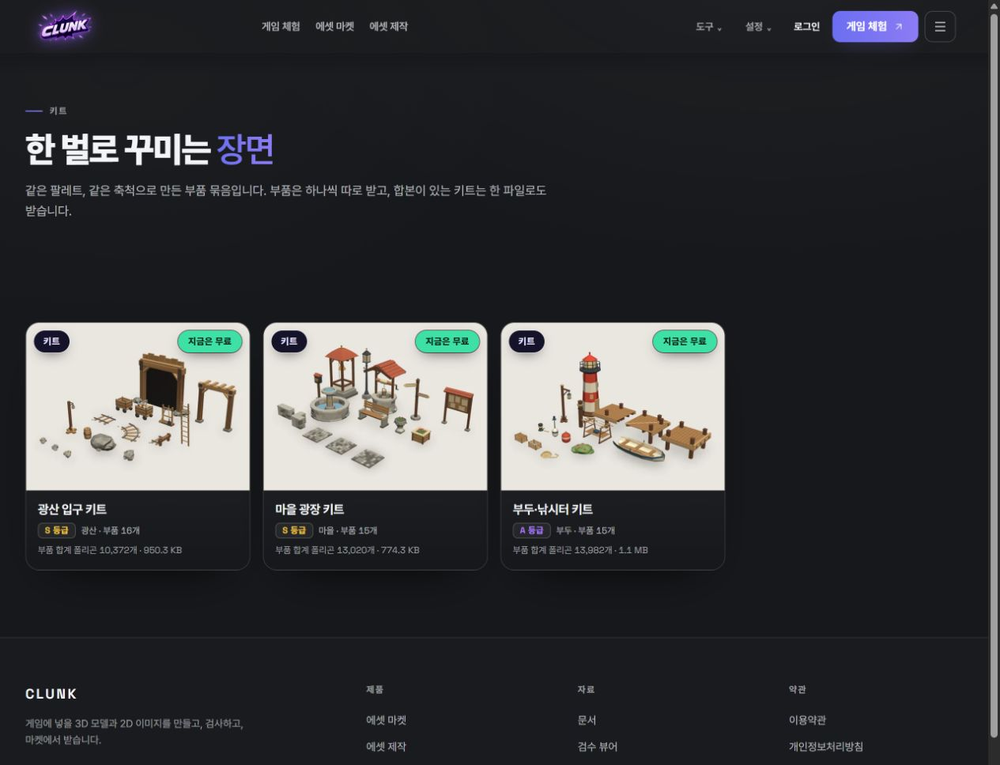
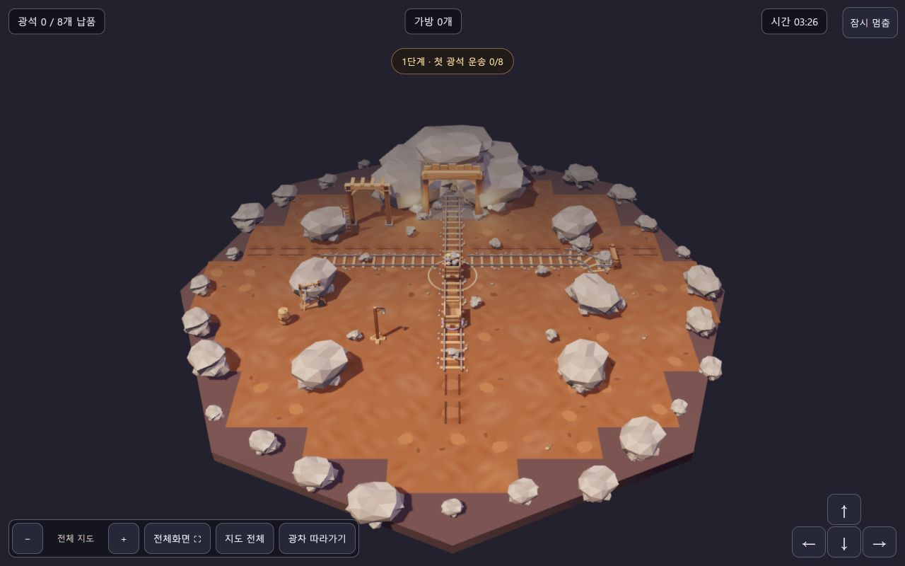

# Clunk · 게임 에셋 확보·제작·검사·프로젝트 적용을 연결하는 무료 베타

[포트폴리오 홈](../../README.md) · [이력서](../resume.ko.md)

> 무료 공개 베타 · 2026.09.12 최신 라이브 화면을 기준으로 작성했습니다. 방문·사용이 아직 매우 적으며, 전문 제작자의 수요와 상업적 품질은 초기 제작자 인터뷰와 실제 프로젝트 과업으로 확인할 예정입니다.

## 누구의 어떤 문제에서 시작했나

게임 제작자가 필요한 에셋을 확보하거나 제작하고, 파일 규격과 내용을 검사한 뒤, 자신의 프로젝트에서 열어 보는 과정을 위한 제품입니다. 에셋을 구하는 곳과 제작 도구, 파일 검사와 프로젝트 적용이 나뉘어 있어 다음 작업으로 넘어가기까지 생기는 부담을 줄이고 싶었습니다.

## 어떤 변화를 만들고 싶었나

**에셋 확보 → 제작·수정 → 파일 검사 → 프로젝트 적용**이라는 목표 흐름을 한곳에서 이어가고, 제작자가 결과물을 실제 프로젝트에서 확인할 수 있게 하려 했습니다. 이는 제품 가설이며, 고객 인터뷰나 측정된 제작 시간 단축 성과가 아닙니다.

2026.09.12 <a href="https://clunk.games/review">공개 검수 뷰어</a>에서 새로 촬영한 화면입니다. `preview-kit-market-alley.glb`에서 읽은 파일 크기 553,440바이트, 폴리곤 8,674개, 덩어리 47개·재질 12개와 실제 미리보기를 보여줍니다. 이 수치는 해당 미리보기 파일의 관측값이며 최적화 완료나 상업적 품질 승인을 뜻하지 않습니다.

2026.09.12 <a href="https://clunk.games/kits">공개 키트 카탈로그</a>에서 새로 촬영한 화면입니다. 카드에 표시된 구성·폴리곤·파일 크기는 현재 공개 목록의 표시값이며, 전체 에셋의 납품 적합성을 보장하지 않습니다.

2026.09.12 <a href="https://clunk.games/starters">공개 게임 체험</a>에서 새로 촬영한 광산 시제품 화면입니다. 현재 구현된 한 장면의 체험을 보여주며, 완성된 상용 게임이나 고객 납품 사례를 뜻하지 않습니다.

## 현재 공개 범위와 목표 범위

| 구분 | 확인할 수 있는 내용 |
| --- | --- |
| 현재 공개 베타 | 키트 카탈로그, 3D 검수 뷰어(2D 스프라이트 탭 포함), 광산 플레이 시제품, 공개 파일 검사 도구 |
| 앞으로 확인할 범위 | 한 개발팀의 한 장면을 정해 에셋 제작·수정·검사·적용까지 연결하고, 실제 엔진에서 열리는지 확인하는 과업 |
| 아직 주장하지 않는 것 | 모든 에셋·엔진 호환, 전문 제작자 수준의 미술 품질, 고객 납품·매출·전환 성과 |

## 제품 판단 세 가지

| 선택한 방향 | 판단 이유 | 지켜야 할 경계 |
| --- | --- | --- |
| 파일에서 읽은 구조·수치를 화면에 함께 표시 | 썸네일이나 설명만 보고 사용 가능하다고 판단하지 않도록 하기 위해 | 파일 검사는 미술 품질·엔진 적용을 대신하지 않음 |
| 자동 검사·실제 렌더·사람의 품질 판단을 분리 | 기술적으로 열리는 것과 프로젝트에 쓸 만한 것은 다를 수 있기 때문 | 자동 통과를 상업 품질 승인으로 표현하지 않음 |
| 무료 베타에서 먼저 한 장면을 검증 | 방문과 사용이 적어 기능 확대보다 실제 사용 과업이 먼저이기 때문 | 수요·가격·반복 사용을 확인하기 전 유료 성과를 주장하지 않음 |

## 내가 맡은 일

제품 방향·요구사항·우선순위·완료 기준을 정하고, AI 도구가 만든 코드·에셋 작업의 범위를 정리했습니다. 브라우저에서 탐색·미리보기·스크롤을 확인하고, 파일에서 읽은 값과 실제 렌더 결과를 대조해 다음 수정 우선순위를 정했습니다.

## 현재 보여줄 수 있는 결과

무료 공개 베타와 파일 생성·저장·검사·최적화·다운로드 흐름, 공개 파일 검사 도구가 있습니다. 최신 라이브 화면은 [검수 뷰어](https://clunk.games/review)와 [키트 카탈로그](https://clunk.games/kits)에서 볼 수 있습니다. 방문·사용이 아직 매우 적어 고객 수·매출·전환율은 측정하지 않았으며, 상업적 품질과 실제 엔진 적용 성공도 아직 확인하지 않았습니다. 초기 제작자 인터뷰와 사용 로그로 수요를 확인한 뒤 적용 과업을 검증할 예정입니다.

[라이브 제품](https://clunk.games) · [공개 파일 검사 도구](https://github.com/Artemis-ignis/clunk-mcp)

Clunk 소스 저장소와 내부 문서는 비공개입니다.

## 다음에 무엇을 검증할 것인가

외부 에셋을 반복해서 통합하는 인디·소규모 게임 개발팀을 대상으로 한 장면과 목표 엔진을 정한 뒤, 필요한 에셋을 찾고 내려받아 실제 프로젝트에서 열어 보는 과업을 관찰하려 합니다. 탐색부터 적용까지 걸린 시간, 중단한 단계와 이유, 실제 표시 성공, 추가 수정과 지원 비용, 다시 사용할 의향과 지불 의사를 따로 기록할 계획입니다. 현재 확보된 고객이나 파일럿 성과를 뜻하지 않습니다.

## 이 경험에서 배운 것

기능을 연결하고 자동 검사를 통과시켜도 제작자가 실제 장면에서 쓸 수 있다는 뜻은 아니었습니다. 제품 약속을 구조적 검사·시각적 품질·엔진 적용으로 나누고, 각 판단에 필요한 근거와 다음 검증 과업을 따로 두는 방식으로 범위를 다시 정했습니다.
