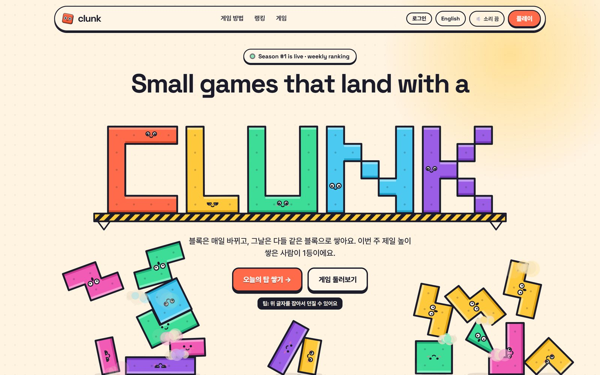
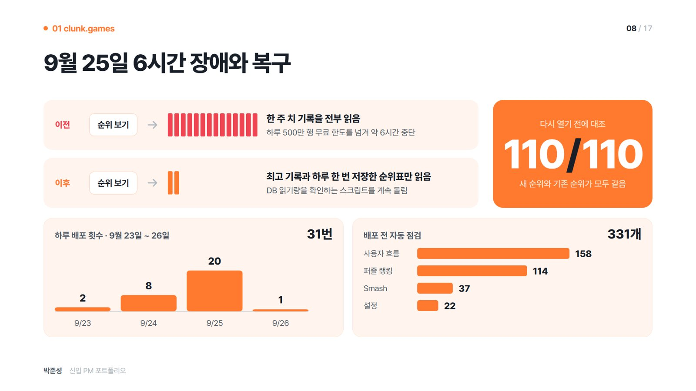

# Clunk · 주간 랭킹 게임 운영과 공정성

[포트폴리오 홈](../../README.md) · [제품 사례 목록](README.md)

> 2026년 10월 6일 확인 기준. 숫자는 사이트가 표시한 값이며 고유한 외부 고객 수로 해석하지 않습니다.

## 현재 제품

Clunk는 탑 쌓기·퍼즐·스매시 세 게임으로 구성된 웹 게임입니다. 매일 모든 플레이어에게 같은 블록 순서를 제공하고, 주간 최고 기록으로 순위를 정합니다. 게임은 로그인 없이도 할 수 있고, 계정 기반 보상 기능도 운영합니다.

홈 화면은 2026년 9월 27일 캡처입니다. 10월 6일 라이브 페이지에서 확인한 사이트 표시값은 누적 랭킹 완료 플레이어 132명이며, 해당 주 랭킹 기록은 아직 없었습니다. 다계정 가능성을 제거한 고유 고객 수가 아닙니다.

## 랭킹 규칙

| 위험 | 제품 기준 |
| --- | --- |
| 매일 게임 조건이 다르면 점수 비교가 불공정함 | 같은 날 모든 플레이어에게 같은 블록 순서를 제공 |
| 클라이언트 점수만 믿으면 기록을 조작할 수 있음 | Puzzle 입력 기록을 서버에서 재생해 점수를 재계산하고, 비정상적으로 높은 기록은 검토 전 보류 |
| 한 IP에서 여러 계정으로 랭킹에 반복 참여할 수 있음 | 관측된 악용 뒤 IP별 가입을 시간당 5개, 하루 8개로 제한 |

## 9월 25일 장애와 복구

랭킹 화면을 열 때마다 주간 기록 전체를 다시 읽는 쿼리가 무료 데이터베이스 읽기 한도를 넘기면서 약 6시간 서비스가 중단됐습니다. 랭킹 조회를 플레이어별 최고 기록 테이블과 하루 한 번 저장하는 순위표로 바꿨습니다. 다시 열기 전에 새 순위 110건을 이전 결과와 전부 대조했습니다.

## 내가 맡은 일

게임 규칙, 랭킹 정책, 다계정 대응 기준, 장애 우선순위와 복구 후 결과 검수를 맡았습니다. AI 도구는 구현·자동 점검·배포에 사용했습니다. 코드와 에셋의 자동 통과는 상업적 품질 승인이나 사용자 가치 검증을 뜻하지 않습니다.

## 현재 확인과 남은 검증

- **확인 가능:** 라이브 게임 세 종, 주간 랭킹 흐름, 서버 점수 재계산, 장애 복구 후 기존 순위 110건 일치.
- **사이트 지표:** 10월 6일 사이트에 누적 랭킹 완료 플레이어 132명 표시. 주간 랭킹은 아직 비어 있었고, 중복 계정 제거 여부를 보장하지 않습니다.
- **아직 없는 근거:** 고객 인터뷰, 반복 이용·유지율, 매출, 게임 만족도.

[라이브 제품](https://clunk.games) · [공개 파일 검사 도구](https://github.com/Artemis-ignis/clunk-mcp)
